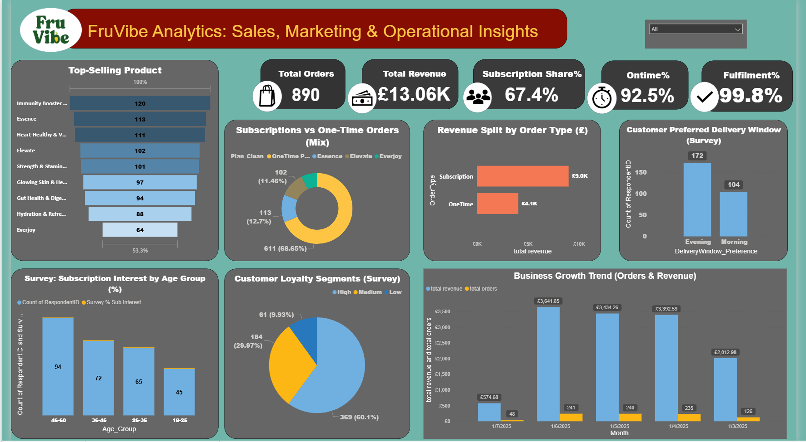
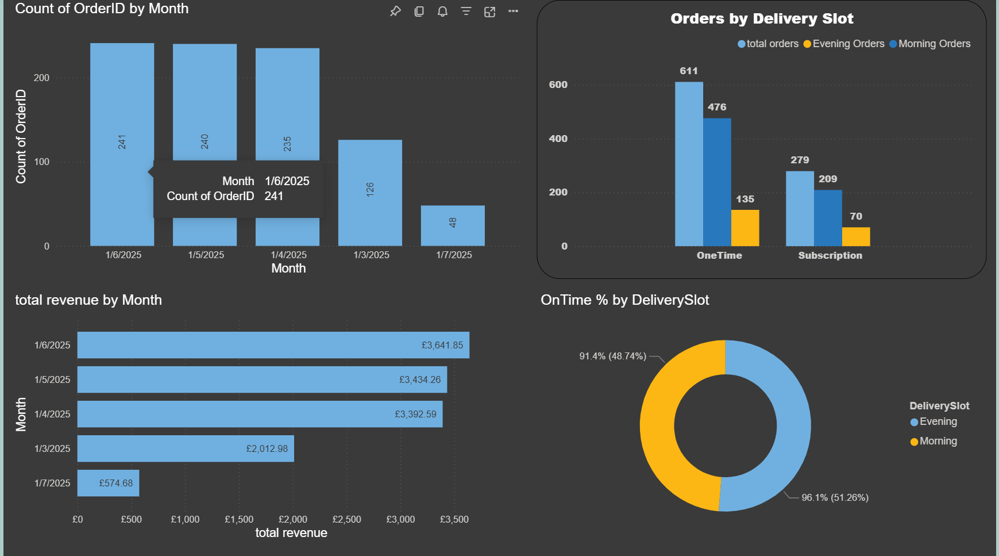
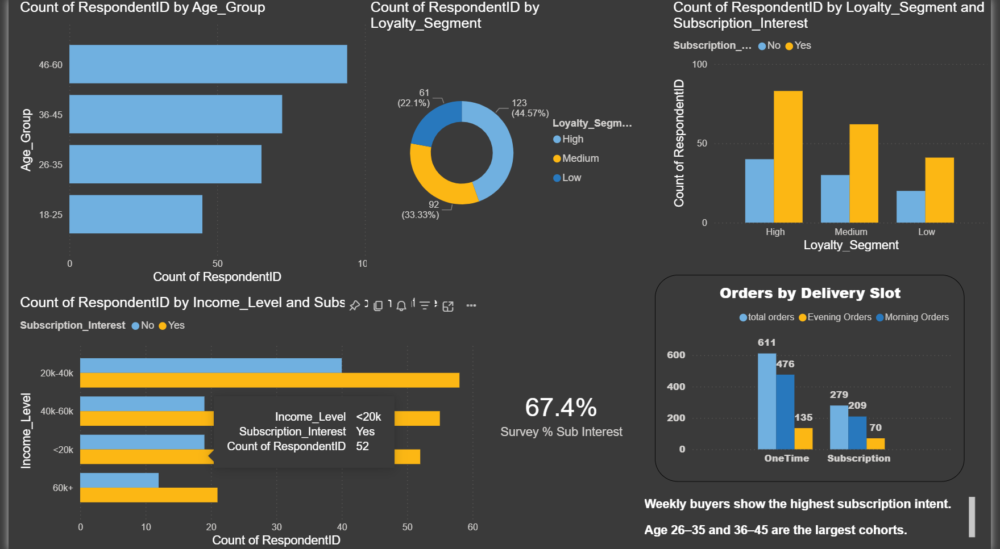
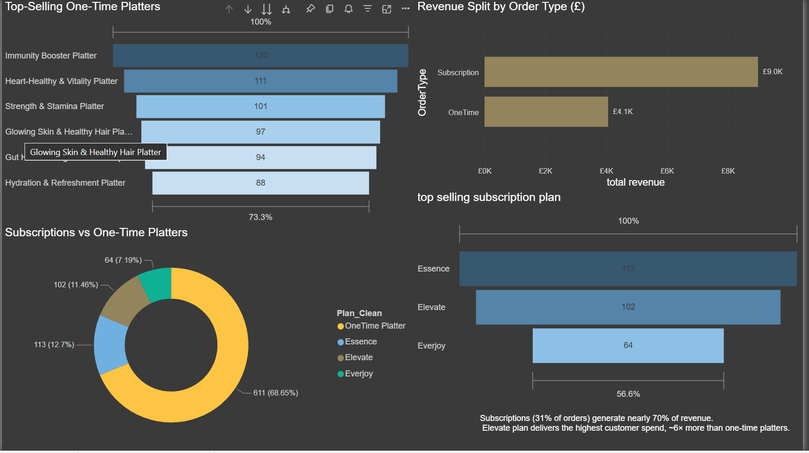
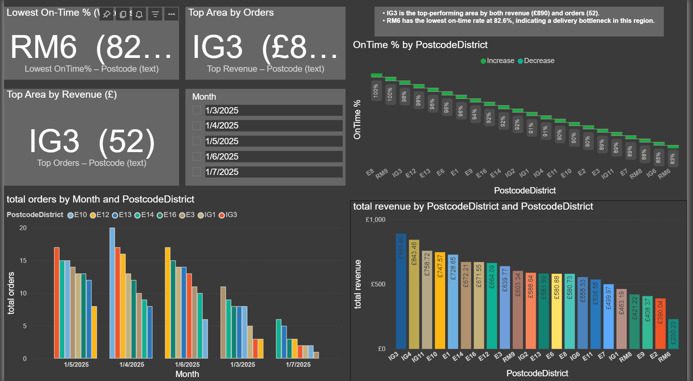

# FruVibe Analytics — Sales, Marketing & Operational Insights  

A complete, end-to-end **data analytics case study** using Python + Power BI.  
This project simulates FruVibe’s pilot in East London (Mar–Jul 2025) to answer:  
**What should we sell, to whom, at what price, and how do we deliver on time?**

<p align="center">
  
</p>

---

## ⚡ TL;DR Results
- **890 orders**, **£13.06K revenue**, **31% subscription share**  
- **On-Time = 92.5%**, **Fulfillment = 99.8%** (Evening beats Morning on both)  
- **Top area:** IG3 (highest orders & revenue)  
- **Top one-time product:** Immunity Booster Platter  
- **Best subscription plan AOV:** Elevate (£39.75 vs one-time £6.65)  

---

## 🚀 Business Problem
FruVibe needed to validate its **subscription model and operations** during a pilot in East London.  
The key business questions were:
1. Which products and plans generate the most revenue?  
2. Who are the most valuable customer segments?  
3. How reliable are morning vs. evening deliveries?  
4. What operational bottlenecks exist?  

---

## 🎯 Objectives
- Clean and prepare raw order & survey data.  
- Build dashboards for **Sales, Marketing, and Operations**.  
- Translate data into **business recommendations**.  

---

## 🛠 Tools & Methods
- **Python (Pandas, NumPy, Matplotlib)** → Data cleaning & processing  
- **Power BI** → Data modeling & dashboards  
- **Excel** → Data validation & quick checks  
- **GitHub** → Version control & portfolio hosting  

---

## 🔑 Key Insights
- 📈 Subscriptions = **31% of orders but ~70% of revenue** → critical for growth  
- 🍓 Immunity Booster Platter = **#1 one-time product**  
- ⏰ Evening deliveries = fewer orders but **higher reliability (96%)**  
- 🛒 60% of customers scored **High loyalty** in survey → strong retention potential  
- ⚠️ RM6 flagged with **lowest On-Time % (82.6%)** → delivery risk zone  

---

## 📊 Dashboards (Power BI)

| Page | Screenshot |
|------|------------|
| **Executive Summary** |  |
| **Operations Dashboard** |  |
| **Customer Insights** |  |
| **Product & Pricing** |  |
| **Geo Insights** |  |

➡️ Full interactive dashboard available in Power BI Service (link coming soon).  
➡️ `.pbix` file included in `dashboards/`.

---

## 📂 Repository Structure

---

## 🧹 Data Preparation
- **Orders dataset**  
  - Parsed dates, standardized text  
  - Engineered features: `IsSubscription`, `IsEvening`, `IsOnTime`, `Month`, `PrePostPilot`  
- **Survey dataset**  
  - Age grouping, loyalty scoring, subscription intent  
- Outputs saved to `data/processed/`:  
  - `orders_clean.csv`  
  - `survey_clean.csv`  

---

## 🧮 DAX Measures (examples)
```DAX
Total Orders = COUNTROWS(orders_clean)
Total Revenue = SUM(orders_clean[Revenue])
OnTime % = DIVIDE([OnTime Orders], [Total Orders])
Fulfillment % = DIVIDE([Fulfilled Orders], [Total Orders])
Subscription % = DIVIDE([Subscription Orders], [Total Orders])
AOV (Morning) = DIVIDE([Revenue (Morning)], [Morning Orders])
AOV (Evening) = DIVIDE([Revenue (Evening)], [Evening Orders])
